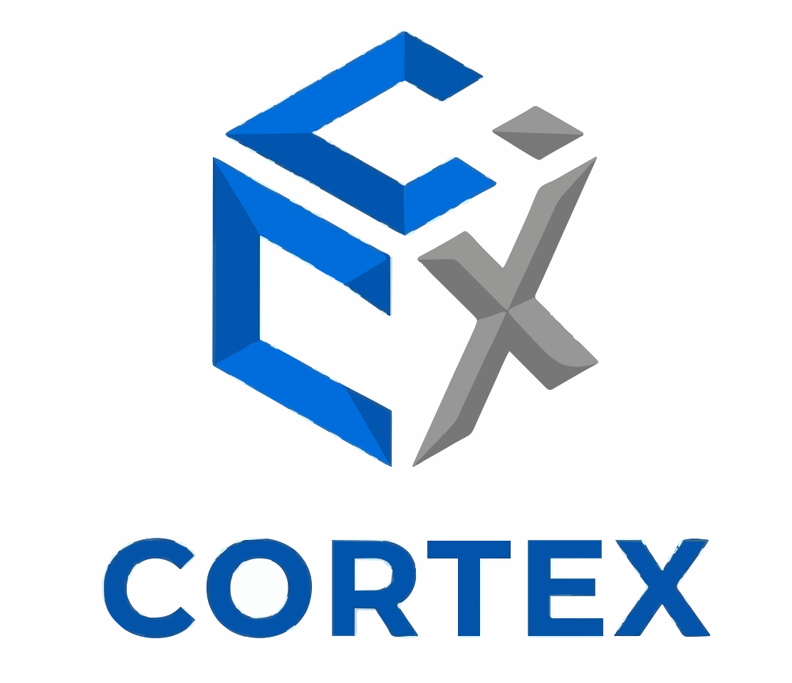

<table>
  <tr>
    <td width="150"></td>
    <td>
      <h1>Cortex Agent Framework</h1>
      <strong>Build production-grade AI agents in a single YAML file.</strong><br/>
      Fan-out / fan-in orchestration, multi-LLM routing, MCP tool servers, quality validation, and delta learning — all driven by <code>cortex.yaml</code>.
    </td>
  </tr>
</table>

<p align="center">
  <a href="LICENSE"></a>
  <a href="https://www.python.org/downloads/"></a>
  
  
  
</p>

<p align="center">
  <a href="docs/OVERVIEW.md">Overview</a> •
  <a href="docs/ARCHITECTURE.md">Architecture</a> •
  <a href="docs/FEATURES.md">Features</a> •
  <a href="docs/GETTING_STARTED.md">Getting Started</a> •
  <a href="docs/USE_CASES.md">Use Cases</a> •
  <a href="docs/CONFIGURATION.md">Config</a> •
  <a href="docs/CLI.md">CLI</a> •
  <a href="docs/DEPLOYMENT.md">Deployment</a> •
  <a href="docs/FAQ.md">FAQ</a>
</p>

---

## Why Cortex?

Every production AI agent eventually needs the same plumbing: task decomposition, parallel tool execution, streaming, validation, retries, session management, multi-provider routing, MCP integration, deployment. Most teams rebuild this stack three times before they ship.

**Cortex is that stack, pre-built and configuration-driven.** Define your agent once in `cortex.yaml`, call `framework.run_session()`, and get a production-ready agent with parallel tool execution, quality scoring, session persistence, hot-reload, and deployability as a Docker service, Python package, or MCP server.

```yaml
agent:
  name: ResearchAgent
  description: Searches the web and writes reports

llm_access:
  default:
    provider: anthropic
    model: claude-sonnet-4-5
    api_key_env_var: ANTHROPIC_API_KEY

task_types:
  - name: web_research
    capability_hint: web_search
    output_format: md
  - name: write_report
    capability_hint: document_generation
    depends_on: [web_research]
```

```python
from cortex.framework import CortexFramework

framework = CortexFramework("cortex.yaml")
await framework.initialize()

result = await framework.run_session(
    user_id="user_1",
    request="Research the latest vector DB benchmarks and write a report",
)
print(result.response)
```

That's the whole agent. Fan-out, tool calls, dependency resolution, synthesis, validation — all handled.

---

## What you get out of the box

| | |
|---|---|
| **8 LLM providers** | Anthropic, OpenAI, Gemini, Grok, Mistral, DeepSeek, AWS Bedrock, Azure AI — swap with one YAML line |
| **Fan-out / fan-in** | Primary agent decomposes into a dependency graph, tasks run in parallel, results synthesised automatically |
| **MCP-native** | First-class support for SSE, stdio, and streamable-HTTP MCP tool servers |
| **Multi-agent mesh** | Publish any agent as an MCP server — other agents consume it as a tool. Compose specialist agents into an orchestrator |
| **Quality validation** | Every response scored on intent match, completeness, coherence. Enforced threshold floor |
| **Delta learning** | Agent proposes new task types from usage patterns; human-in-the-loop review before apply |
| **Streaming** | Typed event stream (`StatusEvent`, `ResultEvent`, `ClarificationEvent`) wires cleanly into FastAPI SSE |
| **Session persistence** | Memory / SQLite / Redis backends with WAL replay and resumable sessions |
| **Dev ergonomics** | Browser setup wizard, hot-reload, dry-run validation, session replay, config migration |
| **Deployability** | One command publishes as Docker image, Python wheel, or MCP server |

---

## Get started in 5 minutes

```bash
git clone <repo-url>
cd cortex-agent-framework
python -m venv .venv && source .venv/bin/activate
pip install -e .

export ANTHROPIC_API_KEY=sk-ant-...
cortex setup             # browser wizard at localhost:7799
cortex dry-run "Hello"   # validates config, no LLM calls
cortex dev               # run in hot-reload mode
```

Full walkthrough → **[docs/GETTING_STARTED.md](docs/GETTING_STARTED.md)**

---

## Documentation

| Document | Read this if you want to… |
|---|---|
| **[Overview](docs/OVERVIEW.md)** | …understand what Cortex is, who it's for, and why it exists |
| **[Architecture](docs/ARCHITECTURE.md)** | …see the internals: primary agent, task graph compiler, MCP agents, validation, learning |
| **[Features](docs/FEATURES.md)** | …scan the full feature matrix before committing |
| **[Getting Started](docs/GETTING_STARTED.md)** | …build your first agent with working code examples |
| **[Use Cases](docs/USE_CASES.md)** | …see real-world scenarios and reference architectures |
| **[Configuration](docs/CONFIGURATION.md)** | …look up every `cortex.yaml` field |
| **[CLI Reference](docs/CLI.md)** | …look up every `cortex` subcommand |
| **[Deployment](docs/DEPLOYMENT.md)** | …ship to production (Docker, wheel, MCP, multi-agent mesh) |
| **[FAQ](docs/FAQ.md)** | …find answers to common questions and gotchas |
| **[Contributing](CONTRIBUTING.md)** | …report bugs or submit pull requests |

---

## Community & support

- **Issues**: file bugs and feature requests on GitHub Issues
- **Discussions**: ask questions and share configs on GitHub Discussions
- **Security**: please report vulnerabilities privately, not in public issues

---

## License

MIT — see [LICENSE](LICENSE). Use it in commercial products, fork it, modify it, ship it.
