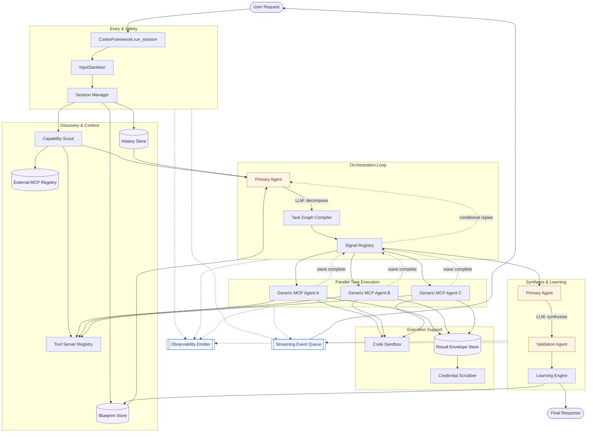
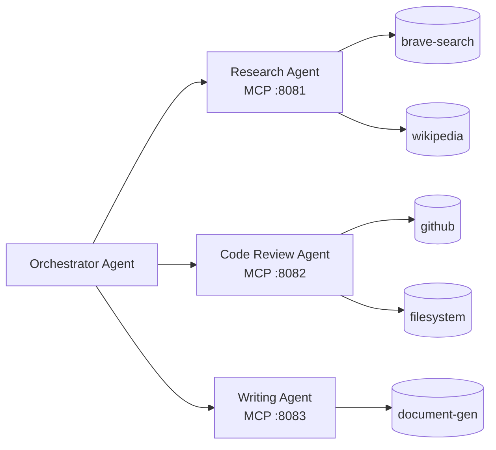

# Architecture

[← Back to README](../README.md)

## The Fan-Out / Fan-In model

Cortex is built around one core pattern: decompose the user's request into a typed task graph, run independent tasks in parallel, synthesise the results, then let the graph grow mid-session when new information demands it.

Solid arrows are in-band calls. Dashed arrows are asynchronous signals and side-channel streams. Purple nodes are persistent stores; orange nodes are LLM-backed agents; blue nodes are cross-cutting streams.

## Components

### Core orchestration

#### CortexFramework
The public entrypoint. `framework.run_session()` drives the entire lifecycle: sanitisation → session creation → capability discovery → decomposition → wave-based execution → synthesis → validation → learning. Everything else is called through here.

**File:** [`cortex/framework.py`](../cortex/framework.py)

#### Primary Agent
The orchestrator. It is invoked in three modes:

1. **Decompose** — receives the sanitised request, relevant history, discovered tools, stale task hints, and any loaded blueprints; calls the LLM to emit a typed task list with dependency edges.
2. **Replan** — called mid-session when an adaptive task completes, a mandatory task fails, or a stale-blueprint task finishes. Grows the existing DAG rather than starting over.
3. **Synthesise** — after all tasks complete, combines the stored result envelopes into a final response.

**Why:** Pushing decomposition into the LLM gives you flexibility — you don't hand-write a state machine for every possible user intent. Re-entering the same agent for replan/synthesise keeps intent coherent across the session.

**File:** [`cortex/modules/primary_agent.py`](../cortex/modules/primary_agent.py)

#### Task Graph Compiler
Turns the raw task list emitted by the Primary Agent into an executable DAG. Validates that every `depends_on` reference points to a real task, detects cycles, registers per-task signals, and exposes `get_ready_tasks()` so the executor can drive waves.

**Why:** LLMs hallucinate task IDs and sometimes emit cyclic graphs. This is the safety net.

**File:** [`cortex/modules/task_graph_compiler.py`](../cortex/modules/task_graph_compiler.py)

#### Signal Registry
Coordinates async completion between parallel task workers. When Task D depends on A, B, C, the Signal Registry is what A/B/C use to signal "I'm done" and what D waits on. Wraps low-level `asyncio` primitives in a task-aware API driven declaratively from the compiled graph.

**File:** [`cortex/modules/signal_registry.py`](../cortex/modules/signal_registry.py)

#### Generic MCP Agent
Executes a single task. Gets the task description, its dependencies' outputs, access to the configured MCP tool servers, and — if enabled — to the Code Sandbox for running generated Python. Calls the LLM in a tool-use loop until the task's output format is satisfied. One instance per task, running in parallel with sibling tasks.

**Why:** Every task goes through the same executor — there's no per-task-type custom code. Add a new task type by adding YAML, not Python.

**File:** [`cortex/modules/generic_mcp_agent.py`](../cortex/modules/generic_mcp_agent.py)

### Discovery & capability

#### Capability Scout
Runs *before* decomposition. Uses the LLM to identify which configured tool servers are relevant to the request, then fetches real tool descriptions from those servers. Also checks the External MCP Registry for auto-discovered servers. Times out gracefully so a slow server can't block the whole session.

**Why:** Hard-coding "the agent has web search" in the prompt breaks the moment you swap tool servers. Dynamic discovery keeps the config as the single source of truth.

**File:** [`cortex/modules/capability_scout.py`](../cortex/modules/capability_scout.py)

#### Tool Server Registry
Holds the lifecycle of all configured MCP tool servers. Starts stdio subprocesses, opens SSE connections, handles reconnection on failure, and tracks each server's advertised capabilities for the Capability Scout.

**File:** [`cortex/modules/tool_server_registry.py`](../cortex/modules/tool_server_registry.py)

#### External MCP Registry
Persistent registry of internet MCP servers auto-discovered mid-run and stored in `cortex_auto_mcps.yaml`. Queried by the Capability Scout before falling back to fresh internet discovery. At session end, any server that requires auth is surfaced to the developer for explicit configuration.

**File:** [`cortex/modules/external_mcp_registry.py`](../cortex/modules/external_mcp_registry.py)

#### Ant Colony
A self-expanding specialist agent mesh. When the Capability Scout identifies a capability gap that no configured or discovered MCP server can fill, it can hatch a new **ant** — an independent Cortex agent running as an MCP server on a dynamically allocated port. Ants are full Cortex agents with their own `cortex.yaml`, specialised for one capability (e.g. `web_search`, `document_generation`).

The `AntColony` module handles: port allocation, per-ant `cortex.yaml` generation, subprocess spawning via a generated Python bootstrap, health-polling until ready, PID supervision with auto-restart, `ants.yaml` persistence across process restarts, and register/deregister callbacks into the Tool Server Registry.

**Trust tier:** Ants are registered with `trust_tier="ant"` — treated like internal servers (write tools not stripped, output guard not applied) but persisted separately from developer-configured servers.

**Lifecycle:**
1. Gap detected → `CapabilityScout._hatch_ants_for_gaps()` calls `AntColony.hatch()`
2. Colony allocates port, writes ant `cortex.yaml`, writes bootstrap script, spawns subprocess
3. Colony polls `/health` until ready (30 s timeout)
4. Ant registered in `ToolServerRegistry` via `register_ant_server()`
5. Supervisor loop monitors PIDs; crashed ants are restarted if `auto_restart: true`
6. On framework shutdown, `stop_all()` terminates all ant subprocesses

**File:** [`cortex/ants/ant_colony.py`](../cortex/ants/ant_colony.py) · [`cortex/ants/ant_server.py`](../cortex/ants/ant_server.py)

### Knowledge & memory

#### Blueprint Store
Persistent task blueprints — markdown templates that capture the workflow, dos/don'ts, and lessons learned for a given task type. Loaded into the Primary Agent's system prompt on the second and subsequent runs of a task type, and auto-updated post-session (with user consent) based on what actually worked. Blueprints can go stale; stale task names are passed into decomposition so the LLM re-discovers subtasks.

**Why:** This is how Cortex "gets better at" recurring workflows without retraining a model — the knowledge lives in versionable markdown that a human can review.

**File:** [`cortex/modules/blueprint_store.py`](../cortex/modules/blueprint_store.py)

#### History Store
Persistent per-user session history. Supplies recent-session context to decomposition and enables resume snapshots. Encryption-capable via config; auto-cleanup of expired records runs at the start of every session.

**File:** [`cortex/modules/history_store.py`](../cortex/modules/history_store.py)

#### Result Envelope Store
Hot store for task result envelopes (`output_value`, status, token usage). Small envelopes stay in-process for speed; large outputs spill to filesystem. Backed by SQLite/Redis for crash resilience, and cleaned up per session unless the session timed out (in which case it's kept for resume).

**File:** [`cortex/modules/result_envelope_store.py`](../cortex/modules/result_envelope_store.py)

#### Learning Engine
Observes task patterns across sessions. When the same decomposition pattern recurs across distinct users, it stages a **delta proposal** — a suggestion to add a task type or tool server to `cortex.yaml`. Proposals are gated by confidence (medium = 3 confirmations, high = 5) and require human review via `cortex delta review`. At session end, the Learning Engine also drives **evolution consent**: if ad-hoc tasks produced reusable scripts, the user can persist them as new task types.

**Why:** Agents drift in the wild. Real user patterns differ from what you predicted at design time. The Learning Engine surfaces those patterns as concrete config changes you can inspect and apply.

**File:** [`cortex/modules/learning_engine.py`](../cortex/modules/learning_engine.py)

### Session & validation

#### Principal (Identity & Delegation)
Immutable identity attached to every session and task. Every framework operation carries a `Principal` so that storage paths, audit logs, observability events, and session ownership work consistently regardless of *who* (or *what*) initiated the request — a human user, a system agent (cron, scheduler), or another agent delegating on a user's behalf.

Three principal types:

- **`user`** — a human end user. `principal_id` is the application-supplied `user_id`.
- **`system`** — an autonomous initiator (scheduler, cron job, background worker). `principal_id` follows `"system:<name>"`.
- **`agent`** — a delegated call where one agent invokes Cortex on behalf of an upstream principal. `principal_id` follows `"agent:<name>"` and the principal carries a `delegation_chain` recording every hop back to the original initiator.

The `storage_key` derived from a principal always resolves to the **origin** id (the first entry in the chain, or the principal_id itself for direct calls), so all hops in a delegation chain share one storage namespace and one history timeline. This is what keeps a sales-bot's research session attributed to the human user who triggered it, not to the bot.

`run_session(user_id=..., principal=...)` accepts an explicit `Principal` for system / delegated calls; for the common human-user case the framework auto-builds one from `user_id`. See **[Getting Started → Caller Identity](GETTING_STARTED.md#caller-identity-user_id-and-principal)** for usage patterns.

**Why:** Agent-to-agent composition needs a way to preserve provenance across hops. Without it, audit logs lose track of who originally authorised a chain of agent calls, and storage gets fragmented per-agent instead of per-user.

**File:** [`cortex/identity.py`](../cortex/identity.py)

#### Session Manager
Enforces concurrency limits (global and per-user), tracks in-flight sessions, persists session state to the configured backend, and handles resume for sessions that timed out. Uses a write-ahead log so a crash during a session doesn't lose work.

**File:** [`cortex/modules/session_manager.py`](../cortex/modules/session_manager.py)

#### Validation Agent
After the Primary Agent produces the final response, the Validation Agent scores it on:

- **Intent match** — did the response actually answer what was asked?
- **Completeness** — did it cover all parts of the request?
- **Coherence** — is the response internally consistent and well-structured?

Scores are combined; if the composite falls below the configured threshold (floor: 0.60), the response is flagged. Validation also runs *inside* the wave loop as a per-task gate: if a task declared an `output_schema` or `validation_notes`, it's validated on completion and retried up to three times with feedback before the wave moves on.

**File:** [`cortex/modules/validation_agent.py`](../cortex/modules/validation_agent.py)

### Safety & isolation

#### Input Sanitiser & Credential Scrubber
The boundary layer. The **Input Sanitiser** strips null bytes and control characters, enforces token limits, and validates MIME types and file paths for uploaded inputs. The **Credential Scrubber** applies configurable regex patterns to task outputs before they're persisted, so API keys and tokens don't leak into result envelopes or history.

**Directory:** [`cortex/security/`](../cortex/security/)

#### Code Sandbox
Isolated subprocess for running LLM-generated Python code. Blocks a configurable import list, enforces CPU/memory limits, and returns captured stdout/stderr to the calling Generic MCP Agent. Paired with the **Agent Code Store**, which persists successful scripts so the Learning Engine can promote them to reusable task types. Off by default — enable via `code_sandbox.enabled` in config.

**Directory:** [`cortex/sandbox/`](../cortex/sandbox/)

### LLM & configuration

#### LLM Client
Multi-provider abstraction over Anthropic, OpenAI, Bedrock, Azure, Mistral, Deepseek, Gemini, Grok, local runtimes, and custom providers. `LLMClient.verify_all()` checks credentials at startup so you fail fast rather than mid-session. Re-exported via [`cortex/providers.py`](../cortex/providers.py) for convenience.

**Directory:** [`cortex/llm/`](../cortex/llm/)

#### Config
YAML loading and schema validation. `load_config()` reads `cortex.yaml` and returns a `CortexConfig` dataclass. Schema validation catches missing or malformed blocks before any session starts.

**Directory:** [`cortex/config/`](../cortex/config/)

### Observability & streaming

#### Observability Emitter
Dual-stream telemetry. The **operational stream** flows to OpenTelemetry (or stdout JSON in dev), sanitised to remove sensitive fields. The **audit log** is an append-only record of every session and task lifecycle event. The emitter also maintains rolling baselines per task type to detect anomalies (tasks that suddenly take 5× longer, cost 5× more tokens, etc.).

**File:** [`cortex/modules/observability_emitter.py`](../cortex/modules/observability_emitter.py)

#### Streaming Event System
Typed event classes flow through the `event_queue` you pass to `run_session`:

- `StatusEvent` — progress updates (`session_start`, `task_start`, `task_complete`, `session_end`, …)
- `ResultEvent` — response content, partial or final, with validation score
- `ClarificationEvent` / `ClarificationRequestEvent` — the agent (or a mid-task tool call) needs more information from the user

Events have stable `event_type` values so you can wire them into any UI (SSE, WebSocket, CLI). A `None` sentinel is queued at session end to close SSE streams cleanly.

**Directory:** [`cortex/streaming/`](../cortex/streaming/)

### Storage backends

Pluggable persistence for sessions, history, envelopes, and blueprints. Three backends ship with Cortex:

- **Memory** — volatile, fastest, good for tests and single-process dev
- **SQLite** — file-based, WAL mode, good for single-host deployments
- **Redis** — distributed, good for multi-worker production deployments

All three implement the same interface; swap via the `storage` config block.

**Directory:** [`cortex/storage/`](../cortex/storage/)

## Request lifecycle

Here's what actually happens when you call `framework.run_session()`, in the order the code executes:

1. **Resolve identity.** If no `principal` was passed, the framework builds one from `user_id` via `Principal.from_user_id()`. The principal is stamped onto every task in the graph and into every observability event so audit trails preserve provenance — including the full delegation chain for agent-to-agent calls.
2. **Sanitise input.** The Input Sanitiser strips control characters and enforces token limits.
3. **Create session.** The Session Manager allocates a `session_id`, enforces concurrency limits, writes to WAL.
4. **Clean expired history.** The History Store garbage-collects records older than the configured retention.
5. **Emit `session_start`.**
6. **Capability discovery.** The Capability Scout asks the LLM which configured tool servers are relevant, fetches real tool descriptions from them, and consults the External MCP Registry. Honours a timeout.
7. **Blueprint staleness check.** For every task type with a blueprint reference, compare `last_successful_run_at` against the configured staleness window; flag stale task names to force re-discovery during decomposition.
8. **LLM call #1 — decompose.** The Primary Agent receives history context, discovered tools, stale task hints, and any loaded blueprints. It emits a typed task list with dependency edges, streamed as `DecomposedTask` objects.
9. **Instantiate the graph.** The Task Graph Compiler validates, detects cycles, registers signals, and exposes `get_ready_tasks()`.
10. **Fan-out / fan-in wave loop.** While ready tasks exist:
    - Grab all dependency-free tasks.
    - Dispatch them in parallel under a `max_parallel_tasks` semaphore.
    - Each Generic MCP Agent runs its tool-use loop, calls MCP servers via the Tool Server Registry, optionally runs code in the Sandbox, and stores its envelope in the Result Envelope Store (scrubbed of credentials).
    - Per-task validation gate: if the task declared an `output_schema` or `validation_notes`, validate and retry up to three times with feedback.
    - Conditional replan: if a stale-blueprint task completed, a mandatory task failed, or an adaptive task completed, call the Primary Agent's `replan()` to grow the DAG before the next wave.
    - Check the session deadline; extend it if the user grants an extension.
11. **LLM call #2 — synthesise.** The Primary Agent combines the stored result envelopes into a final response.
12. **Final validation.** The Validation Agent scores the response on intent / completeness / coherence and applies remediation if below threshold.
13. **Evolution consent.** If ad-hoc tasks produced reusable scripts and validation passed, prompt the user. On consent, the Learning Engine stages new task types and the Agent Code Store persists the scripts.
14. **Blueprint auto-update.** If the user consented and `blueprint.auto_update` is enabled, the Primary Agent generates blueprint patches in a batched LLM call and merges them into the Blueprint Store.
15. **Session complete.** The Session Manager marks done and cleans up result envelopes (kept only if the session timed out, for resume).
16. **Surface auth-required external MCPs.** Any server discovered mid-run that needs credentials is reported to the caller.
17. **Emit `session_end`** and queue the SSE sentinel.

Throughout all of this, the Observability Emitter writes operational telemetry and audit-log entries on a side channel, and typed events are streamed to the caller via `event_queue`.

## Multi-agent composition

Any Cortex agent can be published as an MCP server (`cortex publish mcp`). When it runs in that mode, it exposes its task types as MCP tools. Another Cortex agent can then list it in its `tool_servers` config and call it exactly like any other MCP tool.

Each sub-agent:

- Has its own `cortex.yaml`
- Runs as its own process (deploy and scale independently)
- Has its own storage, concurrency limits, and LLM routing
- Can itself call other MCP servers as tools

There's no custom inter-agent protocol. It's all MCP, all the way down.

## Chat UI

Any agent can also be published as a web chat frontend (`cortex publish ui`). This serves a single-page HTML application over HTTP + SSE that supports:

- Text and file uploads (validated against `file_input` MIME/size config)
- Live-streamed status events and final responses
- Persistent per-user session history (via the existing History Store)
- Configurable auth: anonymous cookie, Bearer token, or HTTP Basic

The UI module lives in [`cortex/ui/`](../cortex/ui/). Configuration is under the `ui` block in `cortex.yaml`. For Docker deployments, `cortex publish docker --with-ui` generates a Dockerfile that launches the chat UI on startup.

See **[DEPLOYMENT.md](DEPLOYMENT.md)** for step-by-step deployment of all four targets.
