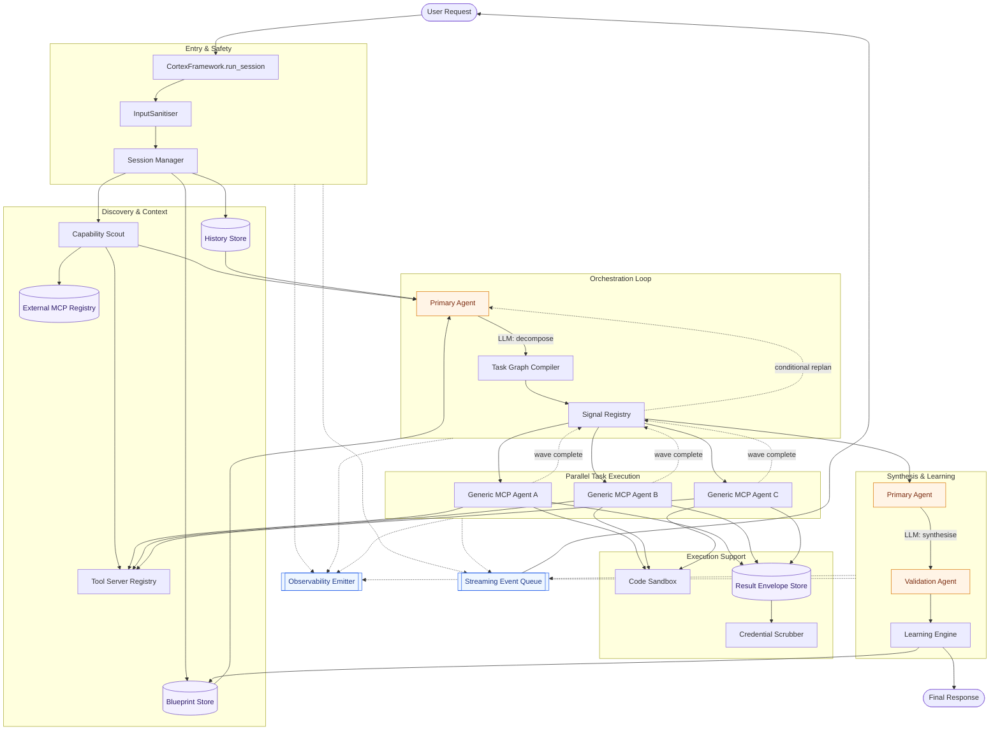
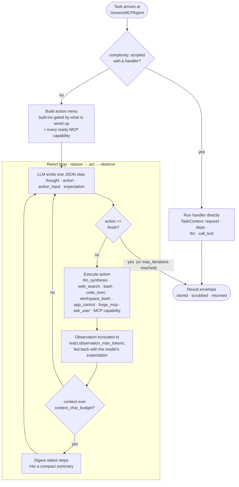
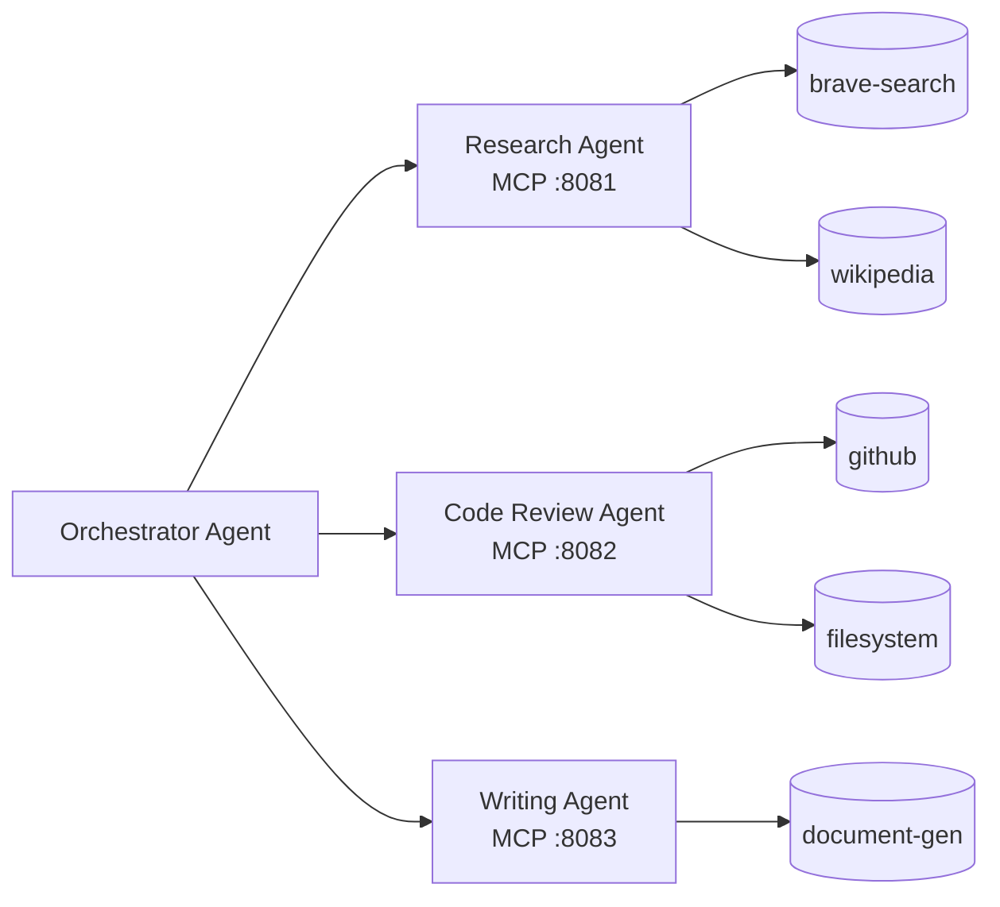

# Architecture

[← Back to README](../README.md)

## The Fan-Out / Fan-In model

Cortex is built around one core pattern: decompose the user's request into a typed task graph, run independent tasks in parallel, synthesise the results, then let the graph grow mid-session when new information demands it.


```mermaid
flowchart TB
    User([User Request])
    Final([Final Response])
    subgraph Entry["Entry & Safety"]
        direction TB
        FW[CortexFramework.run_session]
        SAN[InputSanitiser]
        SM[Session Manager]
        FW --> SAN --> SM
    end

    subgraph Discovery["Discovery & Context"]
        direction TB
        HS[(History Store)]
        BS[(Blueprint Store)]
        CS[Capability Scout]
        TSR[Tool Server Registry]
        EMR[(External MCP Registry)]
        CS --> TSR
        CS --> EMR
    end

    subgraph Orchestration["Orchestration Loop"]
        direction TB
        PA[Primary Agent]
        TGC[Task Graph Compiler]
        SIG[Signal Registry]
        PA -- "LLM: decompose" --> TGC
        TGC --> SIG
    end

    subgraph Execution["Parallel Task Execution"]
        direction LR
        GA1[Generic MCP Agent A]
        GA2[Generic MCP Agent B]
        GA3[Generic MCP Agent C]
    end

    subgraph Support["Execution Support"]
        direction TB
        SBX[Code Sandbox]
        SCR[Credential Scrubber]
        RES[(Result Envelope Store)]
    end

    subgraph Close["Synthesis & Learning"]
        direction TB
        SYN[Primary Agent]
        VA[Validation Agent]
        LE[Learning Engine]
        SYN -- "LLM: synthesise" --> VA --> LE
    end

    OBS[[Observability Emitter]]
    EQ[[Streaming Event Queue]]

    User --> FW
    SM --> HS
    SM --> BS
    SM --> CS
    CS --> PA
    HS --> PA
    BS --> PA
    SIG --> GA1 & GA2 & GA3
    GA1 & GA2 & GA3 --> TSR
    GA1 & GA2 & GA3 --> SBX
    GA1 & GA2 & GA3 --> RES
    RES --> SCR
    GA1 & GA2 & GA3 -. "wave complete" .-> SIG
    SIG -. "conditional replan" .-> PA
    SIG --> SYN
    LE --> BS
    LE --> Final

    Entry -.-> OBS
    Orchestration -.-> OBS
    Execution -.-> OBS
    Close -.-> OBS
    Entry -.-> EQ
    Execution -.-> EQ
    Close -.-> EQ
    EQ --> User

    classDef store fill:#f3f0ff,stroke:#6b46c1,color:#2d1b69
    classDef llm fill:#fff4e6,stroke:#d97706,color:#7c2d12
    classDef side fill:#eef6ff,stroke:#2563eb,color:#1e3a8a
    class HS,BS,EMR,RES store
    class PA,SYN,VA llm
    class OBS,EQ side
```

Solid arrows are in-band calls. Dashed arrows are asynchronous signals and side-channel streams. Purple nodes are persistent stores; orange nodes are LLM-backed agents; blue nodes are cross-cutting streams.

## Components

### Core orchestration

#### CortexFramework
The public entrypoint. `framework.run_session()` drives the entire lifecycle: sanitisation → session creation → capability discovery → decomposition → wave-based execution → synthesis → validation → learning. Everything else is called through here.

The agent definition comes from a `cortex.yaml` file (`CortexFramework("cortex.yaml")`) **or** a `CortexConfig` object built in Python (`CortexFramework(config=...)`) — see the [CortexBuilder](#cortexbuilder) component. `run_session()`'s `event_queue` argument is optional; omit it when only the returned `SessionResult` is needed.

**File:** [`cortex/framework.py`](../cortex/framework.py)

#### Primary Agent
The orchestrator. It is invoked in four modes:

1. **Converse** — used when the Intent Gate classifies a turn as `chat`. Streams a direct reply using history, principal identity, and declared capabilities. Skips scout, decomposition, execution, validation, and evolution entirely.
2. **Decompose** — receives the sanitised request, relevant history, discovered tools, stale task hints, and any loaded blueprints; calls the LLM to emit a typed task list with dependency edges.
3. **Replan** — called mid-session when an adaptive task completes, a mandatory task fails, or a stale-blueprint task finishes. Grows the existing DAG rather than starting over. The replan prompt receives a **trigger reason** label (e.g. `mandatory_failure:<task>`, `stale_blueprint:<task>`, `adaptive_completed`) so it knows *why* it was invoked, and renders each pending task with its full instruction and `depends_on` edges so a `modify`/`remove` op acts on a task body the LLM has actually seen. Completed-task summaries use head-and-tail truncation so trailing URLs and identifiers survive. Maintains a session-scoped `_scratchpad` reasoning trace (≤ 300 words) of confirmed facts, open questions, and strategy adjustments that carries forward across waves.
4. **Synthesise** — after all tasks complete, combines the stored result envelopes into a final response. Before the final LLM call, runs a Tier 1 smart-excerpt pass (keyword-grep) and a Tier 2 concurrent per-file summariser (up to 3 files) over file-output envelopes; injects `_scratchpad` as a **Session Reasoning** block. When file outputs are present the synthesis is written to `synthesis_{session_id}.md` and streamed as a `ResultEvent` with `metadata.output_type="file"`.

**Why:** Pushing decomposition into the LLM gives you flexibility — you don't hand-write a state machine for every possible user intent. Re-entering the same agent for converse/replan/synthesise keeps intent coherent across the session.

**File:** [`cortex/modules/primary_agent.py`](../cortex/modules/primary_agent.py)

#### Intent Gate
Pre-scout turn classifier that decides whether a turn needs the full task pipeline or should flow through `PrimaryAgent.converse()`. A two-stage cascade:

1. **Heuristics** — greeting lexicon, task verbs, known task-type names, and file attachments resolve most turns for zero LLM cost.
2. **LLM classifier** — fires only when the heuristic is under-confident (below `heuristic_confidence_threshold`). Uses a small/cheap model and a short timeout.

Emits a `IntentDecision` with `chat` | `task` | `hybrid` and a confidence score. Disabled when `agent.intent_gate.enabled: false` (every turn is treated as a task). In `agent.interaction_mode: rpc` every turn is forced to the task path regardless.

**Why:** Chat UIs need to answer "hi" without spinning up a DAG. RPC clients want the opposite — every call is work. A single classifier serves both deployment contracts.

**File:** [`cortex/modules/intent_gate.py`](../cortex/modules/intent_gate.py)

#### Task Graph Compiler
Turns the raw task list emitted by the Primary Agent into an executable DAG. Validates that every `depends_on` reference points to a real task, detects cycles, registers per-task signals, and exposes `get_ready_tasks()` so the executor can drive waves.

**Why:** LLMs hallucinate task IDs and sometimes emit cyclic graphs. This is the safety net.

**File:** [`cortex/modules/task_graph_compiler.py`](../cortex/modules/task_graph_compiler.py)

#### Signal Registry
Coordinates async completion between parallel task workers. When Task D depends on A, B, C, the Signal Registry is what A/B/C use to signal "I'm done" and what D waits on. Wraps low-level `asyncio` primitives in a task-aware API driven declaratively from the compiled graph.

**File:** [`cortex/modules/signal_registry.py`](../cortex/modules/signal_registry.py)

#### Generic MCP Agent
Executes a single task. Gets the task description, its dependencies' outputs, access to the configured MCP tool servers, and — if enabled — to the Code Sandbox for running generated Python. Every non-scripted task is run through the **ReAct loop** (see below) until the sub-agent decides the task is done; scripted code-node tasks run their handler directly. One instance per task, running in parallel with sibling tasks.

When `agent.inject_session_context: true` (default), each LLM-synthesis sub-task also receives the **original user request** and the planner's current **`_scratchpad`** in its system prompt, refreshed by the framework at every wave dispatch. This lets a worker reason about *why* its task exists and stay consistent with the overall goal, instead of running blind — while still being told to produce output for its own task only.

**Why:** Every task goes through the same executor — there's no per-task-type custom code. Add a new task type by adding YAML, not Python.

**File:** [`cortex/modules/generic_mcp_agent.py`](../cortex/modules/generic_mcp_agent.py)

#### ReAct Loop
Drives the **reason → act → observe** cycle for one non-scripted task. The Generic MCP Agent builds a `ReactLoop` per task and hands it an `execute_action` callback — the loop owns the reasoning conversation, the agent owns action execution. Each iteration the task's LLM emits one JSON step (`thought`, `action`, `action_input`, `expectation`); the loop runs the action and feeds the observation back **with the model's own stated expectation**, so every reasoning turn sees both what happened and what was intended. A failed action becomes an observation the loop adapts to rather than aborting the task. The loop ends when the model emits a `finish` action; `react.max_iterations` is a safety cap that forces a best-effort final answer otherwise. Observations are capped at `react.observation_max_tokens`, and once the conversation exceeds `react.context_char_budget` the oldest steps are digested into a compact summary.

**Why:** A single LLM call can't recover from a tool that returns something unexpected. Letting the sub-agent observe each result and choose the next action makes every task an adaptive mini-agent — with no per-task-type code.

**File:** [`cortex/modules/react_loop.py`](../cortex/modules/react_loop.py)

#### LLM Concurrency Gate
Every `LLMClient.stream()` / `complete()` call goes through a single async gate so a session running many parallel tasks doesn't overwhelm the configured LLM. The gate's ceiling is derived from the configured `provider:model` at startup via a small lookup table (`cortex/llm/model_power.py`) — `1` for `local:*` (Ollama serializes inference), `8` for `*haiku*` / `*mini*` / `*flash*`, `6` for `*sonnet*` / `*gpt-4o*`, `4` for `*opus*` / `*gpt-4*`, fallback `2`. When `agent.concurrency.adaptive_llm_concurrency` is on (the default), the gate is an **`AdaptiveLLMGate`** that self-tunes via AIMD: halves multiplicatively on errors, empty responses, or sharp latency spikes vs the best observed baseline; grows additively by 1 after a streak of clean calls under saturation. Otherwise it's a static `asyncio.Semaphore` pinned at the ceiling. Queue-wait time is credited to the calling task (`_credit_gate_wait`) so a task's timeout doesn't false-fire while it's queued.

**Why:** The right value of `max_parallel_llm_calls` depends entirely on the backend, and operators don't know it before they've run a workload. Deriving from model identity + self-tuning at runtime removes a guess-and-tune knob from the setup wizard and converges to the correct value on its own.

**Files:** [`cortex/llm/client.py`](../cortex/llm/client.py), [`cortex/llm/adaptive_gate.py`](../cortex/llm/adaptive_gate.py), [`cortex/llm/model_power.py`](../cortex/llm/model_power.py)

### Discovery & capability

#### Capability Scout
Runs *before* decomposition. Uses the LLM to identify which configured tool servers are relevant to the request, then fetches real tool descriptions from those servers. Also checks the External MCP Registry for auto-discovered servers. Times out gracefully so a slow server can't block the whole session.

**Why:** Hard-coding "the agent has web search" in the prompt breaks the moment you swap tool servers. Dynamic discovery keeps the config as the single source of truth.

**File:** [`cortex/modules/capability_scout.py`](../cortex/modules/capability_scout.py)

#### Tool Server Registry
Holds the lifecycle of all configured MCP tool servers. Starts stdio subprocesses, opens SSE connections, handles reconnection on failure, and tracks each server's advertised capabilities for the Capability Scout.

**File:** [`cortex/modules/tool_server_registry.py`](../cortex/modules/tool_server_registry.py)

#### External MCP Registry
Persistent registry of internet MCP servers auto-discovered mid-run and stored in `cortex_auto_mcps.yaml`. Queried by the Capability Scout before falling back to fresh internet discovery. At session end, any server that requires auth is surfaced to the developer for explicit configuration.

**File:** [`cortex/modules/external_mcp_registry.py`](../cortex/modules/external_mcp_registry.py)

#### Ant Colony
A self-expanding specialist agent mesh. When the Capability Scout identifies a capability gap that no configured or discovered MCP server can fill, it can hatch a new **ant** — an independent Cortex agent running as an MCP server on a dynamically allocated port. Ants are full Cortex agents with their own `cortex.yaml`, specialised for one capability (e.g. `web_search`, `document_generation`).

The `AntColony` module handles: port allocation, per-ant `cortex.yaml` generation, subprocess spawning via a generated Python bootstrap, health-polling until ready, PID supervision with auto-restart, `ants.yaml` persistence across process restarts, and register/deregister callbacks into the Tool Server Registry.

**Trust tier:** Ants are registered with `trust_tier="ant"` — treated like internal servers (write tools not stripped, output guard not applied) but persisted separately from developer-configured servers.

**Lifecycle:**
1. Gap detected → `CapabilityScout._hatch_ants_for_gaps()` calls `AntColony.hatch()`
2. Colony allocates port, writes ant `cortex.yaml`, writes bootstrap script, spawns subprocess
3. Colony polls `/health` until ready (30 s timeout)
4. Ant registered in `ToolServerRegistry` via `register_ant_server()`
5. Supervisor loop monitors PIDs; crashed ants are restarted if `auto_restart: true`
6. On framework shutdown, `stop_all()` terminates all ant subprocesses

**File:** [`cortex/ants/ant_colony.py`](../cortex/ants/ant_colony.py) · [`cortex/ants/ant_server.py`](../cortex/ants/ant_server.py)

### Knowledge & memory

#### Blueprint Store
Persistent task blueprints — markdown templates that capture the workflow, dos/don'ts, and lessons learned for a given task type. Loaded into the Primary Agent's system prompt on the second and subsequent runs of a task type, and auto-updated post-session (with user consent) based on what actually worked. Blueprints can go stale; stale task names are passed into decomposition so the LLM re-discovers subtasks.

**Why:** This is how Cortex "gets better at" recurring workflows without retraining a model — the knowledge lives in versionable markdown that a human can review.

**File:** [`cortex/modules/blueprint_store.py`](../cortex/modules/blueprint_store.py)

#### History Store
Persistent per-user session history. Supplies recent-session context to decomposition and enables resume snapshots. Encryption-capable via config; auto-cleanup of expired records runs at the start of every session.

**File:** [`cortex/modules/history_store.py`](../cortex/modules/history_store.py)

#### Result Envelope Store
Hot store for task result envelopes (`output_value`, status, token usage). Small envelopes stay in-process for speed; large outputs spill to filesystem. Backed by SQLite/Redis for crash resilience, and cleaned up per session unless the session timed out (in which case it's kept for resume).

**File:** [`cortex/modules/result_envelope_store.py`](../cortex/modules/result_envelope_store.py)

#### Learning Engine — Autonomic
Signal-driven, consent-free evolution. At end of session the framework runs a two-stage gate:

1. **Skip guards** — chat turns, RPC calls with no principal, or `learning.enabled: false` exit immediately.
2. **Scoring gates** — the `TaskComplexityScorer` produces a deterministic 0.0–1.0 score from envelope + graph signals (code synthesis, tool-trace length, fan-out, deps, tokens, duration); the composite validation score must clear `validation_threshold`. Both gates firing eligible sessions for learning.

Eligible sessions take one of two paths:

- **Ad-hoc tasks** (not declared in `cortex.yaml`) are staged as `DeltaProposal` entries in `cortex_delta/pending.yaml`, with any generated script persisted via `AgentCodeStore` and a **draft blueprint** seeded under `drafts/{task_name}__{hash}` so guidance begins accumulating before promotion. Once a proposal reaches the distinct-principal confidence threshold (default: 3 users = medium), `auto_apply_delta` promotes it into `cortex.yaml` and the draft blueprint is relinked to its permanent location.
- **Known tasks** have their existing blueprints refined via the LLM-driven blueprint auto-update (dos/don'ts, clarifications, lesson summary) — this runs even when the complexity gate doesn't fire, so every successful known-task run can accrete guidance.

A single `LearningEvent` is emitted per session reporting the gate decision (`staged`, `applied`, `blueprint_updated`, `skipped_*`, …); the same label is written to the session's `HistoryRecord.learned_action` field.

**Why:** Consent prompts never worked in RPC / headless deployments and were routinely timed out by users in interactive flows. Making learning a deterministic function of observable signals (validation score + complexity score + intent + identity) means behaviour is the same everywhere and is auditable per session. Distinct-principal accumulation is the real anti-abuse gate — not the prompt.

**Files:**
- [`cortex/modules/learning_engine.py`](../cortex/modules/learning_engine.py)
- [`cortex/modules/task_complexity_scorer.py`](../cortex/modules/task_complexity_scorer.py)

### Session & validation

#### Principal (Identity & Delegation)
Immutable identity attached to every session and task. Every framework operation carries a `Principal` so that storage paths, audit logs, observability events, and session ownership work consistently regardless of *who* (or *what*) initiated the request — a human user, a system agent (cron, scheduler), or another agent delegating on a user's behalf.

Three principal types:

- **`user`** — a human end user. `principal_id` is the application-supplied `user_id`.
- **`system`** — an autonomous initiator (scheduler, cron job, background worker). `principal_id` follows `"system:<name>"`.
- **`agent`** — a delegated call where one agent invokes Cortex on behalf of an upstream principal. `principal_id` follows `"agent:<name>"` and the principal carries a `delegation_chain` recording every hop back to the original initiator.

The `storage_key` derived from a principal always resolves to the **origin** id (the first entry in the chain, or the principal_id itself for direct calls), so all hops in a delegation chain share one storage namespace and one history timeline. This is what keeps a sales-bot's research session attributed to the human user who triggered it, not to the bot.

`run_session(user_id=..., principal=...)` accepts an explicit `Principal` for system / delegated calls; for the common human-user case the framework auto-builds one from `user_id`. See **[Getting Started → Caller Identity](GETTING_STARTED.md#caller-identity-user_id-and-principal)** for usage patterns.

**Why:** Agent-to-agent composition needs a way to preserve provenance across hops. Without it, audit logs lose track of who originally authorised a chain of agent calls, and storage gets fragmented per-agent instead of per-user.

**File:** [`cortex/identity.py`](../cortex/identity.py)

#### Session Manager
Enforces concurrency limits (global and per-user), tracks in-flight sessions, persists session state to the configured backend, and handles resume for sessions that timed out. Uses a write-ahead log so a crash during a session doesn't lose work.

**File:** [`cortex/modules/session_manager.py`](../cortex/modules/session_manager.py)

#### Validation Agent
After the Primary Agent produces the final response, the Validation Agent scores it on:

- **Intent match** — did the response actually answer what was asked?
- **Completeness** — did it cover all parts of the request?
- **Coherence** — is the response internally consistent and well-structured?

Scores are combined; if the composite falls below the configured threshold (floor: 0.60), the response is flagged. Validation also runs *inside* the wave loop as a per-task gate: if a task declared an `output_schema` or `validation_notes`, it's validated on completion and retried up to three times with feedback before the wave moves on.

**File:** [`cortex/modules/validation_agent.py`](../cortex/modules/validation_agent.py)

### Safety & isolation

#### Input Sanitiser & Credential Scrubber
The boundary layer. The **Input Sanitiser** strips null bytes and control characters, enforces token limits, and validates MIME types and file paths for uploaded inputs. The **Credential Scrubber** applies configurable regex patterns to task outputs before they're persisted, so API keys and tokens don't leak into result envelopes or history.

**Directory:** [`cortex/security/`](../cortex/security/)

#### Code Sandbox
Isolated subprocess for running LLM-generated Python code. Blocks a configurable import list, enforces CPU/memory limits, and returns captured stdout/stderr to the calling Generic MCP Agent. Paired with the **Agent Code Store**, which persists successful scripts so the Learning Engine can promote them to reusable task types. Off by default — enable via `code_sandbox.enabled` in config.

**Directory:** [`cortex/sandbox/`](../cortex/sandbox/)

#### WorkspaceBash
Workspace-aware file and command execution with hardcoded Human-in-the-Loop (HITL) gating. The Generic MCP Agent uses `WorkspaceBash` when a task instruction references a workspace directory. All operations are sandboxed to a declared workspace root — path traversal is blocked at resolve time.

- **Read-only operations** (`read_file`, `list_dir`) — no HITL prompt, no approval required.
- **Mutating operations** (`write_file`, `execute`) — fire a mandatory `ClarificationRequestEvent` before acting. `write_file` shows a unified diff when the file already exists. `execute` blocks obviously dangerous patterns (e.g. `rm -rf /`, `sudo`) before the HITL fires.
- **`hitl_enabled` is enforced `True`** in `framework.py` regardless of the config value — it cannot be disabled at runtime.
- **`HITLRelayServer`** — a lightweight aiohttp server spawned per-session so that ant subprocesses can relay their HITL prompts to the parent framework event queue via the `CORTEX_HITL_URL` env var, instead of hanging without a queue.

**File:** [`cortex/modules/workspace_bash.py`](../cortex/modules/workspace_bash.py)

### LLM & configuration

#### LLM Client
Multi-provider abstraction over Anthropic, OpenAI, Bedrock, Azure, Mistral, Deepseek, Gemini, Grok, local runtimes, and custom providers. `LLMClient.verify_all()` checks credentials at startup so you fail fast rather than mid-session. Re-exported via [`cortex/providers.py`](../cortex/providers.py) for convenience.

**Directory:** [`cortex/llm/`](../cortex/llm/)

#### Config
YAML loading and schema validation. `load_config()` reads `cortex.yaml` and returns a `CortexConfig` model. Schema validation catches missing or malformed blocks before any session starts.

**Directory:** [`cortex/config/`](../cortex/config/)

#### CortexBuilder
The code-first alternative to authoring `cortex.yaml`. A fluent builder that assembles a `CortexConfig` in Python — LLM providers, tool servers, task types, and **code nodes**. `.build()` returns a validated config that goes straight to `CortexFramework(config=...)`; no file is read.

The `.node()` decorator registers a plain Python callable as a graph node. Each call is stored in the in-process **handler registry** ([`cortex/handler_registry.py`](../cortex/handler_registry.py)) and referenced from its `TaskTypeConfig.handler` via the `cortex:node:<id>` sentinel scheme — distinct from the dotted-path handlers (`"module.function"`) that `cortex.yaml` `handler:` fields use. At runtime the Generic MCP Agent resolves either form through `_call_handler()`.

**Files:** [`cortex/builder.py`](../cortex/builder.py) · [`cortex/handler_registry.py`](../cortex/handler_registry.py)

### Observability & streaming

#### Observability Emitter
Dual-stream telemetry. The **operational stream** flows to OpenTelemetry (or stdout JSON in dev), sanitised to remove sensitive fields. The **audit log** is an append-only record of every session and task lifecycle event. The emitter also maintains rolling baselines per task type to detect anomalies (tasks that suddenly take 5× longer, cost 5× more tokens, etc.).

**File:** [`cortex/modules/observability_emitter.py`](../cortex/modules/observability_emitter.py)

#### Streaming Event System
Typed event classes flow through the `event_queue` you pass to `run_session`:

- `StatusEvent` — progress updates (`session_start`, `task_start`, `task_complete`, `session_end`, …)
- `ResultEvent` — response content, partial or final, with validation score
- `ClarificationEvent` / `ClarificationRequestEvent` — the agent (or a mid-task tool call) needs more information from the user

Events have stable `event_type` values so you can wire them into any UI (SSE, WebSocket, CLI). A `None` sentinel is queued at session end to close SSE streams cleanly.

**Directory:** [`cortex/streaming/`](../cortex/streaming/)

### Storage backends

Pluggable persistence for sessions, history, envelopes, and blueprints. Three backends ship with Cortex:

- **Memory** — volatile, fastest, good for tests and single-process dev
- **SQLite** — file-based, WAL mode, good for single-host deployments
- **Redis** — distributed, good for multi-worker production deployments

All three implement the same interface; swap via the `storage` config block.

**Directory:** [`cortex/storage/`](../cortex/storage/)

## Request lifecycle

Here's what actually happens when you call `framework.run_session()`, in the order the code executes:

1. **Resolve identity.** If no `principal` was passed, the framework builds one from `user_id` via `Principal.from_user_id()`. The principal is stamped onto every task in the graph and into every observability event so audit trails preserve provenance — including the full delegation chain for agent-to-agent calls.
2. **Sanitise input.** The Input Sanitiser strips control characters and enforces token limits.
3. **Create session.** The Session Manager allocates a `session_id`, enforces concurrency limits, writes to WAL.
4. **Clean expired history.** The History Store garbage-collects records older than the configured retention.
5. **Emit `session_start`.**
6. **Intent Gate classification.** The Intent Gate classifies the turn (heuristic → LLM cascade). In `interaction_mode: rpc`, this step is skipped and every turn is forced to the task path. If the decision is `chat`, the Primary Agent's `converse()` streams a reply directly and the pipeline exits after `session_end`. `task` and `hybrid` continue to step 7.
7. **Capability discovery.** The Capability Scout asks the LLM which configured tool servers are relevant, fetches real tool descriptions from them, and consults the External MCP Registry. Honours a timeout. When the Ant Colony has `auto_hatch_on_gap: true`, unfilled gaps trigger ant spawning before decomposition.
8. **Blueprint staleness check.** For every task type with a blueprint reference, compare `last_successful_run_at` against the configured staleness window; flag stale task names to force re-discovery during decomposition.
9. **LLM call #1 — decompose.** The Primary Agent receives history context, discovered tools, stale task hints, and any loaded blueprints. It emits a typed task list with dependency edges, streamed as `DecomposedTask` objects. Each prior session in the history snippet carries not just request/summary but its **outcome** — task completion counts and the validation verdict — so the decomposer has signal about whether a similar plan shape worked before.
10. **Instantiate the graph.** The Task Graph Compiler validates, detects cycles, registers signals, and exposes `get_ready_tasks()`.
11. **Fan-out / fan-in wave loop.** While ready tasks exist:
    - Grab all dependency-free tasks.
    - Dispatch them in parallel under a `max_parallel_tasks` semaphore.
    - Each Generic MCP Agent runs its task through the ReAct loop — reason → act → observe — calling MCP servers via the Tool Server Registry and optionally running code in the Sandbox, until the sub-agent emits a `finish` action. Scripted code-node tasks skip the loop and run their handler directly. The result envelope is stored in the Result Envelope Store (scrubbed of credentials).
    - Per-task validation gate: if the task declared an `output_schema` or `validation_notes`, validate and retry up to three times with feedback. On each retry the failed attempt is recorded on `RuntimeTask.attempt_history` and threaded into the sub-agent's next LLM call as real conversation turns — the model sees its own prior output followed by the judge's feedback, so it can fix only what the judge flagged instead of regenerating blind. Attempts accumulate, so attempt 3 sees both attempt 1 and attempt 2.
    - Conditional replan: if a stale-blueprint task completed, a mandatory task failed, or an adaptive task completed, call the Primary Agent's `replan()` to grow the DAG before the next wave. The framework passes a specific trigger-reason label so the replan prompt knows what woke it. Replanning is skipped when every task in the wave passed on first attempt with no validator feedback (clean-wave skip). Replan updates the session-scoped `_scratchpad` reasoning trace which carries forward into synthesis.
    - **User interrupt check:** drain the per-session interrupt queue. If a message was injected via `inject_user_message()`, the Primary Agent's `handle_user_interrupt()` is called. Short termination messages (`stop`, `cancel`, etc.) are resolved on a fast path without an LLM call; ambiguous messages go through a dedicated LLM call that returns either `terminate` (break the loop and synthesise completed work) or `replan` (apply add/modify/remove changes to the graph and continue). A `UserInterruptEvent` is emitted with the resolved action.
    - Check the session deadline; extend it if the user grants an extension.
12. **LLM call #2 — synthesise.** The Primary Agent assembles context (Tier 1 smart excerpts + Tier 2 concurrent per-file LLM summaries) from the stored result envelopes, injects the `_scratchpad` as a **Session Reasoning** block, and streams the final response. When tasks produced file outputs the synthesis is also written to `synthesis_{session_id}.md` and announced via a `ResultEvent` with `metadata.output_type="file"`.
13. **Final validation.** The Validation Agent scores the response on intent / completeness / coherence. A response below `validation.critical_threshold` is withheld; one between critical and `threshold` is remediated. Remediation is iterative — up to `validation.max_remediation_attempts` passes, each seeing the prior attempt's response and the findings it still failed, so corrections don't repeat. Intermediate passes run non-streaming; only the delivered response is emitted. If no pass clears `threshold`, the best-scoring candidate across the original and all attempts is delivered.
14. **Autonomic learning gate.** The Learning Engine runs a two-stage gate: skip guards (chat turn, RPC without principal, `learning.enabled: false`) exit immediately; if both the `TaskComplexityScorer` score and composite validation score clear their thresholds, the session is eligible. Ad-hoc tasks are staged as `DeltaProposal` entries in `cortex_delta/pending.yaml` with a draft blueprint seeded; known tasks have their blueprints refined. When `auto_apply_delta: true` (default), proposals promote themselves into `cortex.yaml` once the distinct-principal confidence threshold is met. A single `LearningEvent` is emitted per session recording the gate decision.
15. **Blueprint auto-update.** For any session that was eligible for learning, the Primary Agent generates blueprint patches in a batched LLM call and merges them into the Blueprint Store.
16. **Session complete.** The Session Manager marks done and cleans up result envelopes (kept only if the session timed out, for resume).
17. **Surface auth-required external MCPs.** Any server discovered mid-run that needs credentials is reported to the caller.
18. **Emit `session_end`** and queue the SSE sentinel.

Throughout all of this, the Observability Emitter writes operational telemetry and audit-log entries on a side channel, and typed events are streamed to the caller via `event_queue`.

## Task execution: the ReAct loop

Once the task graph is compiled, **every non-scripted task is executed by a ReAct (reason → act → observe) loop** inside its Generic MCP Agent. There is no separate routing step and no enable/disable flag — the loop *is* the execution model. (Scripted code-node tasks — `complexity: scripted` with a `handler` — skip the loop and run their Python directly; see [Execution modes](#execution-modes).)

Earlier releases dispatched each task to exactly one backend, chosen by a `capability_hint` field or, when that was left as `"auto"`, by an `_infer_capability_hint()` LLM router. The loop replaces both: the sub-agent's own reasoning picks an action each step. An explicitly set `capability_hint` is still honoured where it narrows MCP tool-server selection.

### The reason → act → observe cycle

Each iteration, the task's LLM emits a single JSON step:

```json
{
  "thought": "why this step is needed",
  "action": "web_search",
  "action_input": "vector database benchmarks 2025",
  "expectation": "a list of recent benchmark articles"
}
```

The loop runs the named action, then feeds the observation into the next reasoning turn **together with the model's own stated `expectation`** — so the model always sees both what happened and what it intended. A failed action returns its error as the observation; the loop adapts rather than aborting the task. The loop stops as soon as the model emits `action: "finish"` with a `final_answer`; `react.max_iterations` (default 10) is a safety cap that forces a best-effort final answer if it never does.

To keep the running conversation bounded, each observation is truncated to `react.observation_max_tokens`, and once the conversation exceeds `react.context_char_budget` the oldest steps are digested into a compact summary. A wave-validation retry re-enters the same loop with the prior rejected attempts and the judge's feedback threaded into the opening instruction, so the loop diffs against what failed instead of starting blind.

### The action menu

`action` is chosen from a per-task **action menu** assembled at dispatch. A built-in action is offered only when its backing capability is actually wired up on the agent; every ready MCP tool-server capability is appended so the loop can reach discovered tools too:

| Action | Backend | Offered when |
|---|---|---|
| `llm_synthesis` | `_call_llm` — writing, analysis, reasoning | always |
| `web_search` | Tool server or built-in DuckDuckGo | always |
| `bash` | `BashSandbox` — restricted shell | always |
| `code_exec` | `CodeSandbox` — Python / polyglot execution | a Code Sandbox is configured |
| `forge_mcp` | `ToolForge` — generates a new MCP server on the fly | a Code Sandbox is configured |
| `workspace_bash` | `WorkspaceBash` — read/write/execute in the project dir | `workspace_bash.enabled: true` |
| `app_control` | `AppControl` — drive native desktop apps | `app_control.enabled: true` |
| `browser` | Built-in Playwright MCP — navigate, click, type, screenshot | `playwright_mcp.enabled: true` |
| `ask_user` | HITL clarification prompt | the task sets `human_in_loop: true` |
| *(other MCP capability)* | the registered MCP tool server | a tool server advertises that capability |
| `finish` | — ends the loop, returning the final answer | always |

### Full execution flow


```mermaid
flowchart TD
    T([Task arrives at\nGenericMCPAgent])
    SCRIPTED{"complexity: scripted\nwith a handler?"}
    T --> SCRIPTED
    SCRIPTED -- yes --> H["Run handler directly\nTaskContext: request · deps ·\nllm · call_tool"]
    SCRIPTED -- no --> MENU["Build action menu\nbuilt-ins gated by what is wired up\n+ every ready MCP capability"]

    MENU --> REASON

    subgraph LOOP["ReAct loop  ·  reason → act → observe"]
        direction TB
        REASON["LLM emits one JSON step:\nthought · action · action_input · expectation"]
        FINISH{"action ==\nfinish?"}
        ACT["Execute action\nllm_synthesis · web_search · bash · code_exec ·\nworkspace_bash · app_control · forge_mcp ·\nask_user · MCP capability"]
        OBS["Observation truncated to\nreact.observation_max_tokens,\nfed back with the model's expectation"]
        CAP{"context over\ncontext_char_budget?"}
        COMPACT["Digest oldest steps\ninto a compact summary"]
        REASON --> FINISH
        FINISH -- no --> ACT --> OBS --> CAP
        CAP -- yes --> COMPACT --> REASON
        CAP -- no --> REASON
    end

    FINISH -- "yes  (or max_iterations reached)" --> RESULT
    H --> RESULT
    RESULT([Result envelope\nstored · scrubbed · returned])
```

### App Control: two-path execution

The `app_control` capability uses a two-path strategy to drive arbitrary desktop applications:

1. **Primary — scripting dictionary.** `AppCapabilityScout` introspects the target app: `sdef` on macOS, PowerShell UI Automation tree or COM type-library on Windows, AT-SPI / xdotool on Linux. The compact summary (commands, classes, properties) is injected into the LLM prompt so the generated AppleScript / PowerShell / shell calls target the app's actual API.
2. **Fallback — screenshot vision loop.** When no scripting dictionary is found (e.g. Electron apps, web apps in a browser, native apps with no scripting interface), `AppControl.execute_with_vision_loop()` takes a screenshot, asks a vision-capable LLM for the next action (`ACTION: …` or `DONE: …`), executes it, and repeats up to `max_vision_steps`. A single batch HITL approval covers the whole loop instead of prompting per step.

Every mutating action (launch, script, screenshot) flows through the HITL gate by default. Read-only queries (`get_running_apps`, `get_window_text`, `paste_from_clipboard`) bypass HITL.

### Polyglot code sandbox

`CodeSandbox` dispatches on a `# LANGUAGE:` header comment in the LLM-generated source. Interpreted languages (Node, TypeScript via `ts-node`, Deno, shell, Ruby, Go) are written to `output_dir` and run via the system interpreter. Compiled languages (Rust → `rustc`, C → `cc`, Java → single-file mode, Kotlin → `kotlinc -script`) follow a compile-then-run path. Each ecosystem has an optional package header (`# NPM_PACKAGES:`, `# GEM_PACKAGES:`, `# GO_PACKAGES:`) that triggers `npm install` / `gem install` / `go get` into `output_dir` before execution. Two execution modes beyond the default `execute()` exist: `execute_background()` for long-running servers/daemons (writes `.cortex_pid` and `.cortex_bg.log`) and `execute_streaming()` for line-by-line output via an `on_line` callback.

### Cross-capability data flow

When an upstream task produces files (`ResultEnvelope.output_files`), they are surfaced into the next task's instruction as `UPSTREAM_FILES:` so `app_control` or `code_exec` can act on whatever was just generated — e.g. a `code_exec` task writes a CSV, the next `app_control` task opens it in TextEdit.

### Human-in-the-loop (HITL) during task execution

Regardless of which backend runs, a task with `human_in_loop: true` in its config can pause mid-execution and ask the user a clarifying question. The sub-agent emits an `<ask_human>…</ask_human>` tag in its streamed output; the framework converts this to a `ClarificationRequestEvent` on the SSE stream, waits for the user's answer via `POST /api/session/{id}/clarify`, then resumes the task with the answer injected. Up to three questions are allowed per task attempt.

### User-initiated interrupts (in-flight messages)

Distinct from agent-initiated HITL, users can push a message into a running session at any time via `framework.inject_user_message(session_id, message)`. The message is queued and processed at the next wave boundary — wave atomicity is preserved (the current `asyncio.gather` always runs to completion):

- **Fast-path terminate**: if the message is short and contains a termination keyword (`stop`, `cancel`, `abort`, `quit`, `halt`, `kill`, `enough`, etc.), the framework skips the LLM and immediately sets `user_terminated = True`, breaking the wave loop.
- **LLM-path**: for all other messages, `PrimaryAgent.handle_user_interrupt()` makes one non-streaming LLM call (using `INTERRUPT_REPLAN_SYSTEM` / `INTERRUPT_REPLAN_USER` prompts) that returns either `{"action": "terminate", ...}` or `{"action": "replan", "changes": [...]}`. Replan changes are applied to the pending task graph exactly like the normal `replan()` path (add / modify / remove ops).

In both outcomes the framework emits a `UserInterruptEvent` with the resolved action and then either continues the wave loop (replan) or falls through to synthesis on the completed envelopes (terminate). The CLI surfaces this via `select.select`-based stdin polling in `_interrupt_reader`; SDK consumers call `inject_user_message()` directly from any thread or coroutine.

## Multi-agent composition

Any Cortex agent can be published as an MCP server (`cortex publish mcp`). When it runs in that mode, it exposes its task types as MCP tools. Another Cortex agent can then list it in its `tool_servers` config and call it exactly like any other MCP tool.


```mermaid
flowchart LR
    O[Orchestrator Agent]
    R[Research Agent<br/>MCP :8081]
    C[Code Review Agent<br/>MCP :8082]
    W[Writing Agent<br/>MCP :8083]
    R1[(brave-search)]
    R2[(wikipedia)]
    C1[(github)]
    C2[(filesystem)]
    W1[(document-gen)]

    O --> R --> R1 & R2
    O --> C --> C1 & C2
    O --> W --> W1
```

Each sub-agent:

- Has its own `cortex.yaml`
- Runs as its own process (deploy and scale independently)
- Has its own storage, concurrency limits, and LLM routing
- Can itself call other MCP servers as tools

There's no custom inter-agent protocol. It's all MCP, all the way down.

## Interaction modes

The framework supports two deployment contracts, selected via `agent.interaction_mode`:

- **`interactive`** — chat UIs, CLI, dev mode. The Intent Gate routes conversational turns directly to `converse()`. Task-shaped turns run the full pipeline. Interactive clarifications (`ClarificationEvent`) are permitted because a human is on the other end. Learning runs automatically at end of session via the autonomic gate — no consent prompt is issued.
- **`rpc`** — agent is exposed as a callable (e.g. via `cortex publish mcp`). Every turn is forced to the task path and interactive clarifications are suppressed so automated callers never hang on a prompt they can't answer. If the decomposer returns zero tasks for an `rpc` turn, the synthesiser returns a structured direct response instead of waiting.

Runtime override: `CORTEX_INTERACTION_MODE=interactive|rpc`. `cortex publish mcp` auto-injects `rpc`.

## Execution modes

Orthogonal to interaction mode, `agent.execution_mode` decides **how the task graph is produced**:

- **`planned`** *(default)* — the classic Cortex behaviour. The Intent Gate, Capability Scout, and the decomposition LLM call all run; the Primary Agent generates the task graph at runtime from your `task_types`. Steps 6–9 of the request lifecycle apply.
- **`static`** — the configured `task_types` *are* the graph. The framework builds the `DecomposedTask` list directly from them and instantiates the runtime graph with no intent-gate, capability-scout, or decomposition LLM calls. The fan-out/fan-in wave loop, per-task validation gate, retries, synthesis, validation, and learning all run unchanged. Mid-session replanning is disabled — a static graph is fixed by definition.

Static mode is what powers **code-node agents**. A code node is a task type with `complexity: scripted` and a `handler` — registered in code via `CortexBuilder.node()`, or as a dotted import path in `cortex.yaml`. The Generic MCP Agent's `_call_handler()` runs the callable, passing a `TaskContext` wired with the original request, upstream node outputs (`ctx.deps`), and live `ctx.llm()` / `ctx.call_tool()` helpers. Registering any code node via the builder sets `execution_mode: static` automatically; a static DAG of capability-routed `task_types` (no Python) is also valid via `.execution_mode("static")`.

Per-node outputs are exposed on `SessionResult.node_outputs` (`{node_name: output}`) for both modes — the direct way to read an individual task's result without parsing the synthesised response.

## Chat UI

Any agent can also be published as a web chat frontend (`cortex publish ui`). This serves a single-page HTML application over HTTP + SSE that supports:

- Text and file uploads (validated against `file_input` MIME/size config)
- Live-streamed status events and final responses
- Persistent per-user session history (via the existing History Store)
- Configurable auth: anonymous cookie, Bearer token, or HTTP Basic

The UI module lives in [`cortex/ui/`](../cortex/ui/). Configuration is under the `ui` block in `cortex.yaml`. For Docker deployments, `cortex publish docker --with-ui` generates a Dockerfile that launches the chat UI on startup.

See **[DEPLOYMENT.md](DEPLOYMENT.md)** for step-by-step deployment of all four targets.
